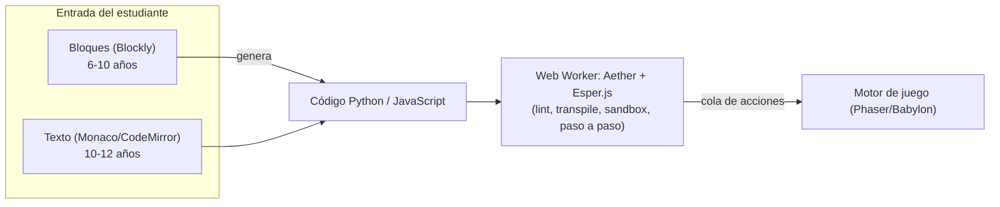
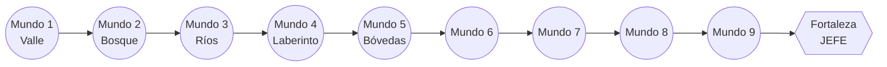

# Plan de Trabajo Técnico y Arquitectura de Software
## Plataforma de Aprendizaje Gamificada de Programación para Niños (6–12 años)
### Fork inspirado en Ozaria / CodeCombat Junior

> **Versión:** 3.0 (orientada a niños de 6 a 12 años)
> **Público objetivo inicial:** niños de **6 a 12 años** (primaria), con diseño adaptativo por edades.
> **Estética:** gráficos llamativos, coloridos y muy gamificados, con look **2.5D / 3D low-poly estilo "Mario de Nintendo 64"**.
> **Stack:** Node.js · TypeScript · Vue 3 · HTML5 Canvas/WebGL · Phaser 3 (2.5D) → Babylon.js (3D, Fase 2) · **Blockly** (bloques) + Monaco (texto) · Aether + Esper.js · PostgreSQL.

---

## 0. Resumen de cambios respecto a versiones anteriores

| # | Tema | v1 / v2 | **v3 (esta versión, foco 6–12 años)** |
|---|------|---------|----------------------------------------|
| 1 | Público | Genérico "niños" | **Tres bandas de edad (6–7, 8–10, 11–12)** con modalidad y currículo adaptados. |
| 2 | Forma de programar | Solo texto (Monaco) | **Doble modalidad: bloques (Blockly) ↔ texto**, con vista lado a lado. Precedente real: CodeCombat Junior. |
| 3 | Lectura/escritura | Asumía que el niño lee y teclea | **Opciones sin lectura y sin tecleo**: bloques de iconos + narración por voz. |
| 4 | Estética | "2D con Phaser" | **2.5D isométrico low-poly (MVP)** evolucionable a **3D low-poly estilo N64 (Babylon.js, Fase 2)**. Renderer abstraído. |
| 5 | Gamificación | Estrellas básicas | **Mapa-mundo navegable estilo Mario**, avatar personalizable, monedas/gemas, insignias, mascota-guía, "juice" (partículas, sonido, animación). |
| 6 | Dispositivos | Implícito escritorio | **Tablet-first** (arrastrar bloques con el dedo), objetivos táctiles grandes. |
| 7 | Motor de ejecución | Esper directo (v1) → Aether/Esper (v2) | Igual que v2 (**Aether sobre Esper.js**), pero ahora **Blockly también emite el mismo código** que entra al sandbox. |
| 8 | Base de datos | Esquema completo (v2) | Mismo esquema + campos de **modalidad, banda de edad y personalización de avatar**. |

Las secciones técnicas de fondo (runner Aether/Esper, esquema PostgreSQL, seguridad, despliegue) se conservan de la v2 y se amplían donde el público infantil lo exige.

---

## 1. Público Objetivo y Diseño por Edades *(el cambio más importante)*

"6 a 12 años" abarca etapas de desarrollo muy distintas. Un niño de 6 años apenas lee y no teclea; uno de 12 puede escribir sintaxis real. **Tratar todo el rango igual es el error pedagógico más común.** La plataforma define **tres bandas** que comparten el mismo motor y mundos, pero cambian la *forma de interactuar*.

| Banda | Edad | Lectura/Tecleo | Modalidad de código | Conceptos núcleo | Mundos sugeridos |
|-------|------|----------------|---------------------|------------------|------------------|
| **Exploradores** | 6–7 | No lectores / no teclean | **Bloques de iconos** (arrastrar imágenes), narración por voz | Secuencias, repetición simple | Mundos 1–2 (versión visual) |
| **Aventureros** | 8–10 | Leen, teclean poco | **Bloques con texto** + vista lado a lado bloques↔código | Bucles, condicionales, variables | Mundos 1–6 |
| **Héroes del código** | 11–12 | Leen y teclean | **Texto real** (Python o JavaScript), bloques opcionales | Funciones, parámetros, listas, algoritmia | Mundos 1–10 |

**Principios de diseño por edad:**
- **6–7:** cero texto obligatorio; instrucciones **habladas**; bloques grandes con un icono claro por comando (flecha, salto, palanca); errores como "el héroe chocó" mostrados con animación, no con mensajes técnicos.
- **8–10:** introducir gradualmente palabras dentro del bloque; la **vista lado a lado** (bloque ↔ código generado) crea el puente mental hacia el texto.
- **11–12:** el bloque se vuelve opcional; se escribe Python/JS real. Los bloques quedan como "rueditas de apoyo" que pueden quitarse.

> **Recomendación de alcance del MVP:** lanzar primero la banda **8–10 (Aventureros)**, que es la más representativa de 6–12 y donde la doble modalidad luce mejor. Añadir Exploradores (voz + iconos puros) y Héroes (texto puro) en iteraciones siguientes.

---

## 2. La Doble Modalidad: Bloques (Blockly) ↔ Texto

La clave para cubrir 6–12 sin construir dos productos: **una sola tubería de ejecución, dos formas de entrada.**



- **Blockly** (librería de Google, open source) es el estándar de bloques (lo usan Scratch-likes, Code.org, Blockly Games). **Genera código** Python o JavaScript a partir de los bloques.
- Ese código generado **entra al mismo runner** (Aether + Esper.js) descrito en §4. No hay un segundo intérprete.
- **Vista lado a lado:** Blockly puede mostrar simultáneamente los bloques y el código que producen; al mover un bloque, el texto se actualiza en vivo. Esto es exactamente lo que hace CodeCombat Junior y es el mejor puente bloques→texto.
- Los **comandos permitidos por nivel** (definidos en el JSON del nivel, §6) determinan qué bloques aparecen en la caja de herramientas y qué funciones se exponen en el sandbox. Una sola fuente de verdad para ambas modalidades.

```javascript
// Definir un bloque de comando y su generación a Python/JS
Blockly.Blocks['avanzar'] = {
  init() {
    this.appendDummyInput().appendField('▶ avanzar');
    this.setPreviousStatement(true);
    this.setNextStatement(true);
    this.setColour(160);
  }
};
// Generador a JavaScript
javascriptGenerator.forBlock['avanzar'] = () => 'heroe.avanzar();\n';
// Generador a Python
pythonGenerator.forBlock['avanzar'] = () => 'heroe.avanzar()\n';
```

---

## 3. Motor Gráfico: el estilo "Mario de Nintendo 64"

Aquí hay una decisión de ingeniería importante y conviene ser honesto sobre el costo.

### 3.1. El dilema 2D vs 3D real

"Estilo Mario 64" sugiere **3D low-poly, colorido y con personalidad**. Pero el 3D libre (caminar en cualquier dirección) es **difícil de enseñar con código** y multiplica el costo de arte y desarrollo. Lo que hace que la programación sea *enseñable* es un movimiento por **casillas/waypoints** (avanzar, girar, saltar), no la física libre de un plataformero.

Por eso recomiendo un enfoque por fases que **da el aspecto de consola sin perder la enseñabilidad**:

| Opción | Motor | Aspecto | Costo | Cuándo |
|--------|-------|---------|-------|--------|
| **A — 2.5D isométrico low-poly** ⭐ | **Phaser 3** + arte 3D pre-renderado / isométrico | Muy llamativo, "consola", coloreado | Bajo–medio | **MVP** |
| **B — 3D low-poly real (estilo N64)** | **Babylon.js** o Three.js | 3D completo, cámara orbital, personajes 3D | Alto | **Fase 2**, tras validar |
| C — 2D plano clásico | Phaser 3 | Sencillo, menos "wow" | Bajo | No recomendado para este público |

**Recomendación:** empezar en **2.5D isométrico low-poly (Opción A)** — se ve cercano a un juego de consola, rinde bien en tablets y mantiene el modelo por casillas. **Abstraer el renderer** detrás de una interfaz (`IRenderer`) para poder migrar a **Babylon.js (3D real estilo N64)** en la Fase 2 sin reescribir la lógica del juego ni el runner.

```typescript
// Interfaz que aísla la lógica del juego del motor de render concreto
interface IRenderer {
  cargarNivel(config: NivelConfig): Promise<void>;
  reproducirAccion(accion: Accion): Promise<void>; // animación de una acción
  resetear(): void;
  resaltarObjetivo(id: string): void;
}
// MVP: PhaserRenderer (2.5D)  ·  Fase 2: BabylonRenderer (3D N64)
```

### 3.2. Conseguir el "look N64"

- **Paleta brillante y saturada**, contornos suaves, formas redondeadas, baja densidad de polígonos.
- **Personaje protagonista con personalidad** (mascota) — el equivalente a Mario: expresivo, animaciones de idle/salto/celebración.
- **Cámara isométrica fija o ligeramente orbital** (en 3D real).
- **Assets low-poly gratuitos/CC0:** los packs de **Kenney.nl** (CC0) son ideales para prototipar el estilo N64 sin presupuesto de arte. Complementar con arte original para el héroe y los mundos.
- **"Juice" (jugosidad):** partículas al recoger monedas, rebote al saltar, sonido por acción, pequeño *screen shake*, celebración con confeti al ganar estrellas. Esto es lo que hace que un niño quiera seguir jugando.

---

## 4. El Motor Invisible: Aether + Esper.js + Render

(Sin cambios de fondo respecto a v2; aplica igual venga el código de bloques o de texto.)

### 4.1. Cadena de ejecución real
Al pulsar **"Ejecutar"** (todo en un **Web Worker**):
1. El código (escrito o **generado por Blockly**) llega al Worker.
2. **Aether** lo lintea (JSHint), parsea (Esprima/Acorn), transpila Python→AST-JS, normaliza e instrumenta.
3. **Esper.js** lo ejecuta paso a paso con un **`executionLimit`** (valor real en CodeCombat junior: `100 000`; por defecto `3 000 000`) que corta bucles infinitos.
4. Cada llamada a la API del juego (`heroe.avanzar()`) **encola una acción**; al terminar, la cola va al hilo principal y el render la anima.

> Modelo recomendado para el MVP: **Web Worker + cola de acciones** (desacopla ejecución y animación, no bloquea la UI, permite retroceder la simulación). El modelo avanzado de **pre-simulación de frames** (time-travel debugging estilo CodeCombat) queda para v2.

```javascript
// DENTRO DEL WEB WORKER (idéntico para bloques o texto)
import Aether from 'aether';
self.onmessage = (e) => {
  const { codigo, lenguaje, apiPermitida } = e.data;
  const acciones = [];
  const heroe = {
    avanzar:        () => acciones.push({ cmd: 'avanzar' }),
    girarDerecha:   () => acciones.push({ cmd: 'girar', dir: 'derecha' }),
    saltar:         () => acciones.push({ cmd: 'saltar' }),
    activarPalanca: () => acciones.push({ cmd: 'palanca' }),
    // solo se inyectan los comandos que el nivel permite
  };
  const aether = new Aether({ language: lenguaje, executionLimit: 100000 });
  try {
    aether.transpile(codigo);
    const fn = aether.createFunction();
    aether.run(fn, heroe);
    self.postMessage({ ok: true, acciones });
  } catch (err) {
    self.postMessage({ ok: false, error: aether.problems?.errors?.[0] ?? { message: String(err) }, accionesParciales: acciones });
  }
};
```

> ⚠️ Las firmas exactas de Aether (`createFunction`/`run`/`flow`) deben confirmarse contra la versión del repo `codecombat/aether` que adoptes; el patrón y el `executionLimit` están verificados.

### 4.2. Seguridad del sandbox
Web Worker (sin DOM/red/almacenamiento) · Esper.js (intérprete, nunca `eval` nativo) · `executionLimit` + timeout · límite de memoria de la cola · CSP estricta · pruebas de inyección en QA (§12).

---

## 5. Gamificación y Mapa-Mundo estilo Mario *(motivación 6–12)*

Para esta edad, la **estructura de juego** importa tanto como el contenido. Elementos:

### 5.1. Mapa-mundo navegable (overworld)
Un **mapa tipo Super Mario World**: nodos conectados por caminos; cada nodo es un nivel; al completarlo se "abre" el camino al siguiente y se desbloquean mundos. Da sensación de aventura y progreso visible.



### 5.2. Elementos de gamificación
- **Avatar personalizable:** elegir héroe, color, sombrero/accesorios (se compran con monedas del juego). Aumenta el apego.
- **Monedas y gemas:** recompensa por completar niveles y por código eficiente; alimentan la tienda de cosméticos.
- **Estrellas (1–3) por nivel:** ⭐ completar · ⭐⭐ objetivo extra · ⭐⭐⭐ solución eficiente (mínimas líneas/sentencias).
- **Insignias/logros:** "Primer bucle", "Sin pistas", "Mundo dominado".
- **Mascota-guía:** un personaje que explica, anima y da pistas con voz (clave para no lectores).
- **Niveles "jefe":** cierre de mundo con un desafío integrador (Mundo 10 = jefe mecánico).
- **Feedback positivo constante:** celebración animada al ganar, nunca penalización dura por error; el error se presenta como "vuelve a intentarlo".

### 5.3. Audio y narración
- **Música** alegre por mundo y **efectos** por acción.
- **Narración por voz** de instrucciones y pistas (TTS o grabaciones) — imprescindible para 6–7 años. Aprovecha tu experiencia previa con agentes de voz/ElevenLabs para generar narraciones en español neutro/colombiano.

---

## 6. UX para Niños y Accesibilidad

- **Tablet-first:** arrastrar bloques con el dedo; objetivos táctiles ≥ 48px; sin menús densos.
- **UI por iconos**, texto mínimo, tipografía grande y redonda, alto contraste.
- **Sin lectura obligatoria** en la banda 6–7: todo lo esencial también se escucha.
- **Sesiones cortas** y guardado automático (la atención infantil es breve).
- **Cero contenido distractor o publicidad.** Entorno cerrado y seguro.
- **Accesibilidad:** considerar daltonismo (no depender solo del color), subtítulos de la narración, modo de movimiento reducido.

---

## 7. Modelo de Datos (PostgreSQL) — ajustes para el público infantil

Se conserva el esquema completo de la v2 (instituciones, usuarios, aulas, inscripciones, cursos, mundos, niveles, sesiones, envíos, pistas, logros, telemetría). **Adiciones para v3:**

```sql
-- Nuevos tipos
CREATE TYPE modalidad_codigo AS ENUM ('bloques','bloques_texto','texto');
CREATE TYPE banda_edad       AS ENUM ('exploradores','aventureros','heroes'); -- 6-7 / 8-10 / 11-12

-- usuarios: añadir banda de edad y personalización del avatar
ALTER TABLE usuarios
  ADD COLUMN banda_edad        banda_edad NOT NULL DEFAULT 'aventureros',
  ADD COLUMN modalidad_pref    modalidad_codigo NOT NULL DEFAULT 'bloques_texto',
  ADD COLUMN avatar_config     JSONB,        -- { heroe, color, sombrero, accesorios }
  ADD COLUMN monedas           INT NOT NULL DEFAULT 0,
  ADD COLUMN gemas             INT NOT NULL DEFAULT 0,
  ADD COLUMN fecha_nacimiento  DATE;         -- para derivar banda y consentimiento (Ley 1581)

-- sesiones_nivel: registrar en qué modalidad se resolvió (analítica de transición bloques->texto)
ALTER TABLE sesiones_nivel
  ADD COLUMN modalidad_usada   modalidad_codigo,
  ADD COLUMN programa_bloques  JSONB;        -- snapshot del XML/JSON de Blockly (si aplica)

-- envios_codigo: distinguir origen (bloques vs texto)
ALTER TABLE envios_codigo
  ADD COLUMN origen modalidad_codigo NOT NULL DEFAULT 'texto';
```

> Esto permite al docente ver **quién ya migró de bloques a texto**, métrica pedagógica muy valiosa.

El resto del esquema (DDL de tablas, índices GIN sobre `configuracion`, vista `v_progreso_aula`, telemetría particionada por mes) se mantiene tal como en la v2.

---

## 8. Formato de Definición de Niveles (JSONB) — con soporte por edad

Se amplía el formato de la v2 para soportar modalidad, narración y bloques permitidos:

```jsonc
{
  "version": 2,
  "banda_recomendada": "aventureros",          // exploradores | aventureros | heroes
  "modalidades": ["bloques", "bloques_texto", "texto"],
  "tilemap": "mundos/01/nivel-03.json",
  "spawn": { "x": 2, "y": 5, "dir": "derecha" },

  "comandos_permitidos": ["avanzar", "girarDerecha", "activarPalanca"],
  "bloques_disponibles": ["avanzar", "girarDerecha", "activarPalanca", "repetir"],
  "codigo_inicial": { "python": "# Lleva al héroe a la salida\n", "javascript": "// ...\n" },

  "narracion": {                                // para no lectores (6-7)
    "intro": "audio/n1-03-intro-es.ogg",
    "exito": "audio/exito-es.ogg"
  },

  "objetivos": [
    { "id": "salida", "tipo": "alcanzar_celda", "x": 8, "y": 5, "obligatorio": true },
    { "id": "moneda", "tipo": "recoger", "item": "moneda", "cantidad": 3 }
  ],
  "criterios_estrella": {
    "1": { "objetivos": ["salida"] },
    "2": { "objetivos": ["salida", "moneda"] },
    "3": { "objetivos": ["salida", "moneda"], "max_bloques": 5 }
  },
  "pistas": [
    { "texto": "El héroe mira a la derecha.", "audio": "audio/n1-03-pista1-es.ogg" }
  ],
  "recompensa": { "monedas": 10, "gemas": 1 },
  "tope_ejecucion": 50000
}
```

---

## 9. Diseño Curricular — Los 10 Mundos, mapeados por edad

Mismos 10 mundos de tu plan, ahora con **banda de edad** y **modalidad sugerida**. Las narrativas se conservan; cambia *cómo* se presenta el reto según la edad.

| Mundo | Concepto | Comandos clave | Banda principal | Modalidad |
|-------|----------|----------------|-----------------|-----------|
| **1. Valle de las Secuencias** | Orden lineal | `avanzar`, `girar`, `activarPalanca` | 6–7 / 8–10 | Bloques |
| **2. Bosque de los Bucles** | Iteración fija `repetir(N)` | `repetir`, `saltar` | 6–7 / 8–10 | Bloques |
| **3. Ríos de la Condición** | `si` (if) y sensores | `si(caminoDespejado())` | 8–10 | Bloques + texto |
| **4. Laberinto del Eco** | `mientras` (while) | `mientras(noLlegueAlFinal())` | 8–10 | Bloques + texto |
| **5. Bóvedas Variables** | Variables, asignación | `crearVariable`, `modificar` | 8–10 | Bloques + texto |
| **6. Ciudad de los Operadores** | Booleanos y comparaciones | `>`, `<`, `==`, `Y`, `O`, `NO` | 8–10 / 11–12 | Texto (bloques opc.) |
| **7. Cumbres de las Funciones** | Funciones sin parámetros | `definirFuncion`, `llamar` | 11–12 | Texto |
| **8. Mercado de los Parámetros** | Argumentos y retorno | `disparar(angulo, potencia)` | 11–12 | Texto |
| **9. Archivos del Vector** | Listas, índices | `obtenerElemento`, `longitudDe` | 11–12 | Texto |
| **10. Fortaleza del Algoritmo** | Integración / jefe final | (todos combinados) | 11–12 | Texto |

**Lectura del mapa:** los Mundos 1–2 son la puerta de entrada universal (incluso para 6 años, en bloques de iconos con voz). El currículo se "endurece" hacia texto puro en los Mundos 7–10 (11–12 años). Cada mundo mantiene su objetivo de aprendizaje, criterios de estrellas y ~6–7 niveles (≈ 65 niveles totales) descritos en la v2.

---

## 10. Pipeline de Assets (estilo low-poly / N64)

| Tipo | Herramienta | Formato | Nota |
|------|-------------|---------|------|
| Modelos 3D low-poly (Fase 2) | Blender + **Kenney.nl (CC0)** | glTF/glb | Estilo N64 sin presupuesto de arte |
| Sprites/atlas (MVP 2.5D) | TexturePacker | Atlas PNG + JSON | Arte 3D pre-renderado a sprites |
| Mapas | **Tiled** | JSON Tilemap | Casillas isométricas |
| Personaje héroe | Arte original | atlas / glb | Mascota con personalidad (animaciones idle/salto/celebración) |
| Audio (música/SFX) | Audacity / packs CC0 | `.ogg` + `.mp3` | Alegre, por mundo |
| Narración (voz) | TTS (ElevenLabs) / grabación | `.ogg` | Español; clave para no lectores |

Almacenamiento en **S3 + CloudFront**, versionado por hash, caché larga.

---

## 11. Backend, Frontend, i18n (resumen; detalle en v2)

- **Backend (Node + TS + Fastify):** endpoints de auth JWT, currículo, sesiones, envíos, tienda de cosméticos (monedas/gemas), dashboard docente. El servidor recalcula estrellas (no confía en el cliente).
- **Frontend (Vue 3 + Pinia):** componentes `MapaMundo`, `EditorBloques` (Blockly), `EditorTexto` (Monaco), `GameCanvas` (renderer abstracto), `Tienda`, `PanelDocente`. Phaser/Babylon viven fuera del árbol reactivo de Vue.
- **i18n:** **español por defecto**; alemán e inglés disponibles (contexto Colegio Alemán). Traducir UI, narrativas, pistas y mensajes de error. Comandos en español en mundos iniciales, transición a inglés en los avanzados.

---

## 12. Seguridad, Cumplimiento y QA

- **Datos de menores (Colombia — Ley 1581/2012 y Decreto 1377/2013):** consentimiento del tutor obligatorio; minimización (estudiantes sin email); política de retención/borrado; auditoría de accesos docentes. Sin publicidad ni rastreo de terceros.
- **Sandbox:** Web Worker + Esper.js + `executionLimit` + timeout + CSP.
- **QA:** unitarias (Vitest), pruebas de inyección al sandbox, integración Worker↔render, E2E (Playwright), carga del endpoint de envíos (k6), y **playtesting con niños reales por banda de edad** (lo más decisivo: validar que un niño de 7 entiende el bloque, y uno de 11 no se aburre).

---

## 13. Cronograma Mejorado (28 semanas)

El foco infantil añade trabajo (Blockly, narración, mapa-mundo, arte llamativo), así que amplío de 24 a **28 semanas**, con MVP jugable temprano para la banda 8–10.

```mermaid
gantt
    dateFormat  YYYY-MM-DD
    title Cronograma 28 semanas - MVP banda 8-10 en semana 12
    section Infra y backend
    Servidor + BD + Auth (Prisma/Postgres/JWT)        :a1, 2026-01-01, 4w
    Endpoints currículo, progreso, tienda             :a2, after a1, 2w
    section Motor de ejecución
    Worker + Aether/Esper (cola de acciones)          :b1, after a1, 3w
    section Entrada de código
    Integracion Blockly + generadores Py/JS           :c1, after b1, 3w
    Vista lado a lado bloques-texto + Monaco          :c2, after c1, 1w
    section Motor de juego (2.5D)
    Phaser isometrico + tilemaps + animaciones        :d1, after a1, 4w
    Bridge cola->animacion + juice (particulas/audio) :d2, after d1, 2w
    section Gamificacion
    Mapa-mundo + avatar + monedas/estrellas/insignias :e1, after d2, 2w
    section MVP
    Vertical slice: Mundo 1-2 jugable (8-10 anos)     :crit, m1, after e1, 1w
    section Contenido y bandas
    Narracion por voz + banda 6-7 (iconos)            :f1, after m1, 2w
    Maquetacion Mundos 3-10 + banda 11-12 (texto)     :f2, after m1, 8w
    section Cierre
    QA, inyeccion, playtesting por edad, optimizacion :g1, after f2, 3w
    Babylon 3D (Fase 2, opcional)                     :g2, after g1, 0w
    Docker/CapRover + S3/CloudFront + despliegue       :g3, after g1, 1w
```

**Hitos:** Semana 4 backend+BD · Semana 9 código (bloques y texto) ejecutándose · **Semana 12 MVP jugable (Mundos 1–2, banda 8–10)** → *playtesting con niños* · Semana 22 los 10 mundos + 3 bandas · Semana 28 despliegue. El **3D real (Babylon)** queda como Fase 2 posterior al lanzamiento 2.5D.

> **Nota realista:** con 1–2 personas, prioriza **banda 8–10 + Mundos 1–5 en bloques** para el primer semestre escolar; amplía bandas y mundos después. La narración por voz de ~65 niveles y el arte llamativo son los costos ocultos mayores.

---

## 14. Despliegue (tu ecosistema AWS)

Igual que v2: build en CI → imagen Docker → **CapRover en EC2** → **RDS PostgreSQL** → **S3 + CloudFront** para assets. Migraciones con `prisma migrate deploy`. Vigila el RAM (tu caso previo con `t2.small`): el bundle crece con Blockly/Phaser/Babylon → build en CI y runtime liviano, o instancia `t3.medium`+. WebGL exige probar en el **hardware real de las tablets/PC del colegio**.

---

## 15. Riesgos y Mitigaciones (foco infantil)

| Riesgo | Impacto | Mitigación |
|--------|---------|------------|
| Rango 6–12 tratado uniforme | Alto | Tres bandas con modalidad y currículo distintos. |
| Querer 3D N64 desde el día 1 | Alto | 2.5D en MVP; renderer abstracto; Babylon en Fase 2. |
| Niños no lectores quedan fuera | Alto | Bloques de iconos + narración por voz obligatoria en 6–7. |
| Rendimiento WebGL en tablets escolares | Medio | Probar en hardware real; low-poly; modo reducido. |
| Costo de narración y arte de 65 niveles | Alto | TTS para narración; assets CC0 (Kenney); lanzar con menos niveles. |
| API de Aether/Esper poco documentada | Alto | Fijar versión; capa de adaptación propia. |
| Datos de menores (legal) | Alto | Consentimiento tutor, minimización, Ley 1581. |
| Contenido de Ozaria propietario | Medio | Usar solo libs MIT (esper.js/aether); currículo y arte originales. |

---

## 16. Licenciamiento

`esper.js` y `aether`: **MIT** (reutilizables). **Blockly**: licencia Apache 2.0 (libre). Arte/música de CodeCombat: CC-BY. **El contenido/niveles de Ozaria y CodeCombat son propietarios** → construye currículo, narrativas, niveles y arte **originales**. Verifica la licencia exacta del repo de Ozaria antes de copiar cualquier asset o código.

---

## 17. Resumen de Decisiones Clave (v3)

1. **Público 6–12 en tres bandas** (6–7, 8–10, 11–12), no un público único.
2. **Doble modalidad: Blockly (bloques) ↔ texto**, ambas hacia el mismo runner. Precedente: CodeCombat Junior.
3. **Sin lectura ni tecleo obligatorios** para los más pequeños: iconos + narración por voz.
4. **2.5D low-poly en el MVP**, con renderer abstracto para escalar a **3D estilo N64 (Babylon.js)** en Fase 2.
5. **Gamificación fuerte:** mapa-mundo estilo Mario, avatar personalizable, monedas/estrellas/insignias, mascota-guía, "juice".
6. **Tablet-first**, UI por iconos, accesible.
7. **Aether sobre Esper.js** en Web Worker (cola de acciones); PostgreSQL con JSONB; despliegue AWS/CapRover/RDS/S3.
8. **Empezar por banda 8–10 + Mundos 1–5**; ampliar después.
9. **Cumplimiento Ley 1581** desde el diseño.

---

*Plan de trabajo técnico v3.0, orientado a niños de 6 a 12 años. Las firmas exactas de la API de Aether/Esper.js deben confirmarse contra la versión del repositorio adoptado.*
